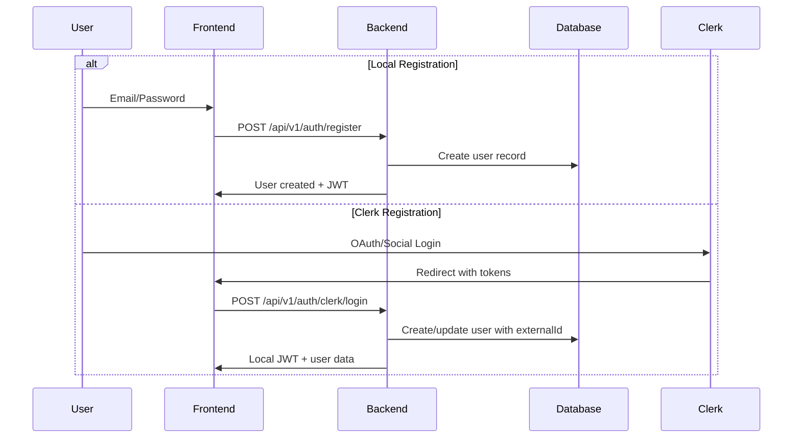
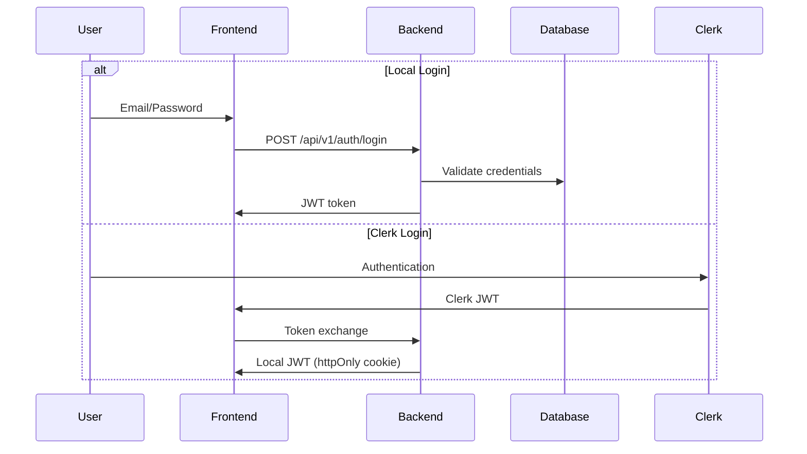
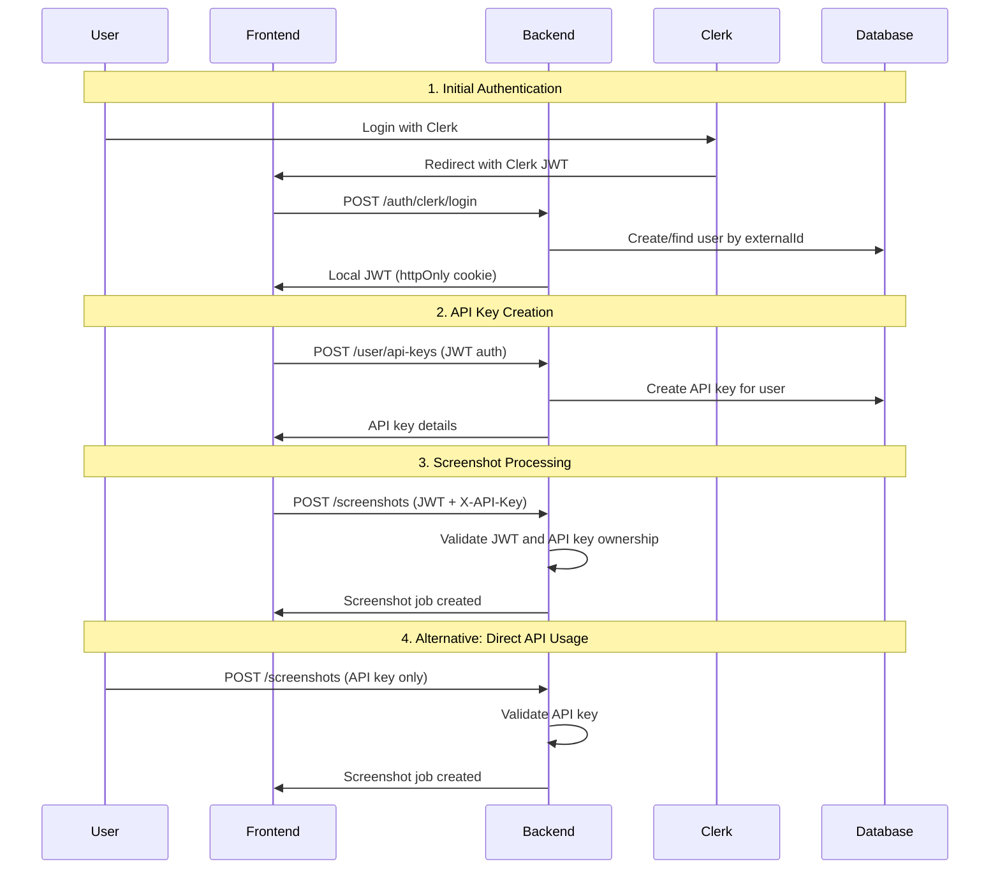

# Authentication & Authorization Flow Documentation

## Overview

The Screenshot API implements a sophisticated multi-provider authentication system that supports both local authentication and third-party providers (like Clerk), with a hybrid authorization model that enforces API key requirements for screenshot processing while maintaining a seamless user experience for dashboard users.

## Architecture Components

### 1. Authentication Providers

#### Local Authentication Provider
- **Purpose**: Traditional email/password authentication
- **Implementation**: `LocalAuthProvider.kt`
- **Features**:
  - JWT token generation and validation
  - Password hashing with secure algorithms
  - Local user management
  - Direct database integration

#### Clerk Authentication Provider
- **Purpose**: Third-party authentication via Clerk
- **Implementation**: `ClerkAuthProvider.kt`
- **Features**:
  - OAuth2/OIDC integration
  - External user management
  - Token exchange mechanism
  - Social login support

#### Provider Factory Pattern
```kotlin
class AuthProviderFactory {
    fun getProvider(type: String): AuthProvider = when (type) {
        "local" -> LocalAuthProvider()
        "clerk" -> ClerkAuthProvider()
        else -> throw UnsupportedProviderException()
    }
}
```

### 2. Multi-Provider Authentication Flow

#### Registration Flow


#### Login Flow


### 3. Token Exchange Mechanism

#### Frontend Token Exchange (Next.js)
```typescript
// Server-side token exchange in dashboard layout
export async function ensureTokenExchange(): Promise<TokenExchangeResult> {
  const { sessionId } = await auth()
  const template = 'screenshot-api'
  
  // Get Clerk token
  const clerkToken = await clerkClient.sessions.getToken(sessionId, template)
  
  // Exchange with backend
  const response = await fetch('/api/v1/auth/clerk/login', {
    method: 'POST',
    body: JSON.stringify({ token: clerkToken })
  })
  
  // Store local JWT in httpOnly cookie
  cookies().set('jwt', localJWT, { httpOnly: true, secure: true })
}
```

#### Backend Token Processing
```kotlin
// ClerkAuthProvider processes external tokens
class ClerkAuthProvider : AuthProvider {
    override suspend fun validateToken(token: String): AuthResult {
        // Verify Clerk JWT signature and claims
        val clerkUser = verifyClerkToken(token)
        
        // Find or create local user
        val localUser = userRepository.findByExternalId(clerkUser.id, "clerk")
            ?: createUserFromClerkData(clerkUser)
        
        // Generate local JWT
        val localJWT = generateJWT(localUser)
        
        return AuthResult.Success(localUser, localJWT)
    }
}
```

### 4. Hybrid Authorization Model

#### The Problem
- **Dashboard users** expect seamless UX with JWT authentication
- **API processing** requires explicit API keys for rate limiting and billing
- **Security principle**: "No API key, no screenshot processing"

#### The Solution: Hybrid Authentication
```kotlin
class ScreenshotController {
    private suspend fun extractAuthenticationInfo(call: ApplicationCall): AuthInfo {
        val apiKeyHeader = call.request.headers["X-API-Key"]
        val jwtPrincipal = call.principal<UserPrincipal>()
        val apiKeyPrincipal = call.principal<ApiKeyPrincipal>()

        return when {
            // Priority 1: X-API-Key header (with optional JWT validation)
            apiKeyHeader != null -> {
                val apiKey = validateApiKeyHeader(apiKeyHeader)
                
                // If JWT present, validate ownership
                if (jwtPrincipal != null && apiKey.userId != jwtPrincipal.userId) {
                    throw AuthorizationException.ApiKeyNotOwned()
                }
                
                AuthInfo(apiKey.userId, apiKey.keyId)
            }
            
            // Priority 2: API Key from Authorization header (standalone)
            apiKeyPrincipal != null -> {
                AuthInfo(apiKeyPrincipal.userId, apiKeyPrincipal.keyId)
            }
            
            // Priority 3: JWT only - require API key
            jwtPrincipal != null -> {
                throw AuthorizationException.ApiKeyRequired()
            }
            
            // No authentication
            else -> throw AuthenticationException.InvalidCredentials()
        }
    }
}
```

### 5. API Usage Patterns

#### Dashboard Users (JWT + X-API-Key)
```http
POST /api/v1/screenshots
Authorization: Bearer <jwt_token>
X-API-Key: sk_user_123_abc...
Content-Type: application/json

{
  "url": "https://example.com",
  "format": "PNG"
}
```

#### Programmatic Users (API Key Only)
```http
POST /api/v1/screenshots
Authorization: Bearer sk_user_123_abc...
Content-Type: application/json

{
  "url": "https://example.com",
  "format": "PNG"
}
```

#### JWT Only (Returns 402 Error)
```http
POST /api/v1/screenshots
Authorization: Bearer <jwt_token>
Content-Type: application/json

Response: 402 Payment Required
{
  "code": "API_KEY_REQUIRED",
  "message": "Valid API key required for screenshot processing",
  "details": {
    "action": "Create an API key in your dashboard",
    "endpoint": "/api/v1/user/api-keys"
  }
}
```

### 6. Exception-Based Error Handling

#### Domain Exceptions
```kotlin
sealed class AuthenticationException : BusinessException {
    class InvalidCredentials : AuthenticationException("Invalid credentials")
    class AccountLocked : AuthenticationException("Account is locked")
}

sealed class AuthorizationException : BusinessException {
    class ApiKeyRequired : AuthorizationException("API key required")
    class ApiKeyNotOwned : AuthorizationException("API key not owned")
    class InsufficientPermissions : AuthorizationException("Insufficient permissions")
}
```

#### Exception Handlers
```kotlin
// Automatic HTTP status code mapping
exception<AuthorizationException.ApiKeyRequired> { call, cause ->
    call.respond(HttpStatusCode.PaymentRequired, ErrorResponseDto(
        code = "API_KEY_REQUIRED",
        message = cause.message,
        details = mapOf(
            "action" to "Create an API key in your dashboard",
            "endpoint" to "/api/v1/user/api-keys"
        )
    ))
}
```

### 7. Adding New Authentication Providers

#### Step 1: Implement AuthProvider Interface
```kotlin
class GoogleAuthProvider : AuthProvider {
    override suspend fun validateToken(token: String): AuthResult {
        // Verify Google JWT
        val googleUser = verifyGoogleToken(token)
        
        // Map to local user
        val localUser = userRepository.findByExternalId(googleUser.id, "google")
            ?: createUserFromGoogleData(googleUser)
        
        return AuthResult.Success(localUser, generateJWT(localUser))
    }
}
```

#### Step 2: Register in Factory
```kotlin
class AuthProviderFactory {
    fun getProvider(type: String): AuthProvider = when (type) {
        "local" -> LocalAuthProvider()
        "clerk" -> ClerkAuthProvider()
        "google" -> GoogleAuthProvider()  // New provider
        "github" -> GitHubAuthProvider()  // Another provider
        else -> throw UnsupportedProviderException("Provider $type not supported")
    }
}
```

#### Step 3: Add Route Handler
```kotlin
// Add to MultiProviderAuthController
post("/auth/google/login") {
    val authProvider = authProviderFactory.getProvider("google")
    val token = call.receive<TokenRequest>().token
    
    when (val result = authProvider.validateToken(token)) {
        is AuthResult.Success -> {
            call.respond(HttpStatusCode.OK, mapOf(
                "jwt" to result.jwt,
                "user" to result.user.toDto()
            ))
        }
        is AuthResult.Failure -> {
            call.respond(HttpStatusCode.Unauthorized, 
                ErrorResponseDto.unauthorized(result.message)
            )
        }
    }
}
```

### 8. Security Considerations

#### JWT Security
- **Secure Storage**: httpOnly cookies in frontend
- **Token Rotation**: Configurable expiration times
- **Audience Validation**: Specific audience claims
- **Signature Verification**: RS256 or HS256 algorithms

#### API Key Security
- **Hashed Storage**: Only hashes stored in database
- **Prefix Identification**: Public prefixes for identification
- **Rate Limiting**: Per-key rate limiting
- **Audit Logging**: Usage tracking and monitoring

#### Cross-Provider Security
- **External ID Mapping**: Secure mapping between external and internal users
- **Token Validation**: Strict validation of external tokens
- **Provider Isolation**: Independent failure modes
- **Privilege Escalation Protection**: Consistent authorization checks

### 9. Benefits of This Architecture

#### For Developers
- **Extensibility**: Easy to add new providers
- **Maintainability**: Clear separation of concerns
- **Testability**: Mockable provider interfaces
- **Type Safety**: Kotlin's type system prevents errors

#### For Users
- **Choice**: Multiple authentication options
- **Security**: Strong authentication and authorization
- **Performance**: Efficient token caching
- **UX**: Seamless dashboard experience

#### For Operations
- **Monitoring**: Centralized authentication metrics
- **Debugging**: Clear error codes and messages
- **Scalability**: Stateless authentication
- **Compliance**: Audit trail for all authentications

### 10. Complete Flow Example



This architecture provides a robust, scalable, and secure foundation for multi-provider authentication while maintaining the flexibility to add new providers and adapt to changing requirements.